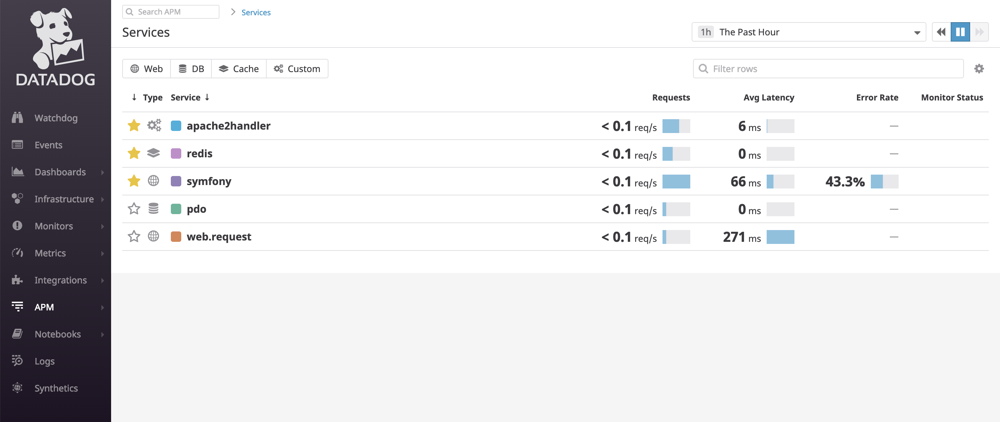
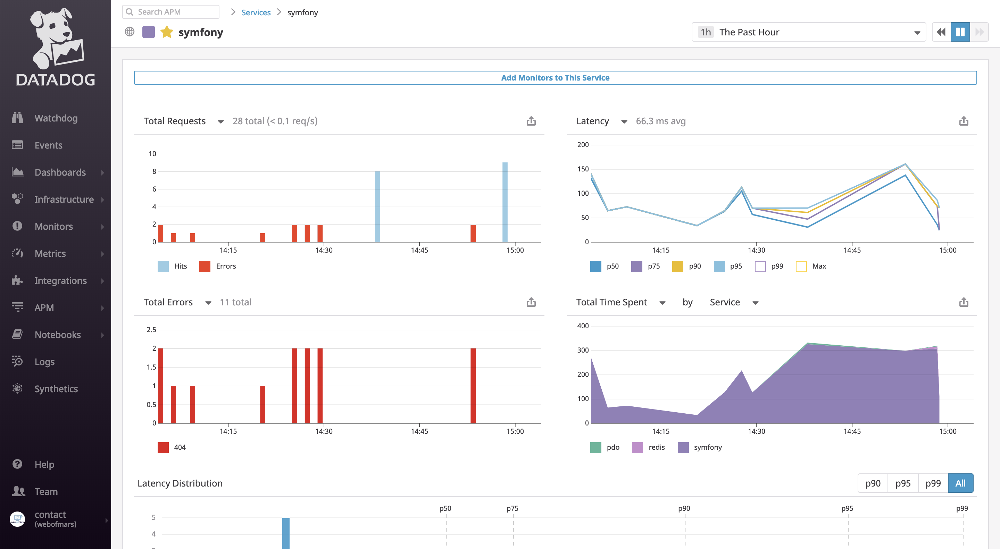
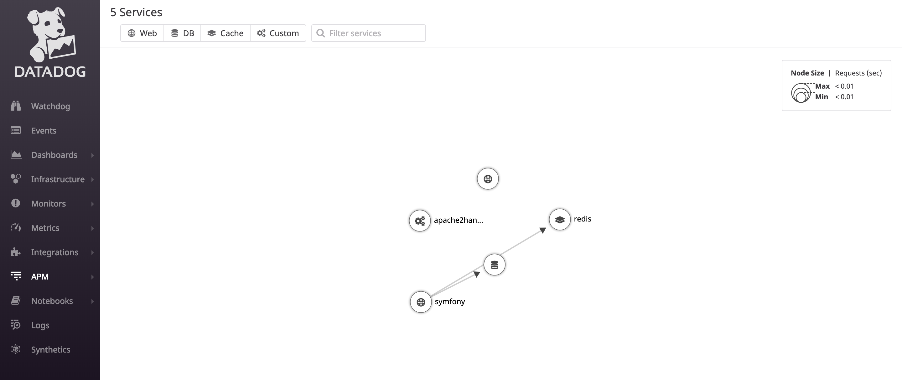
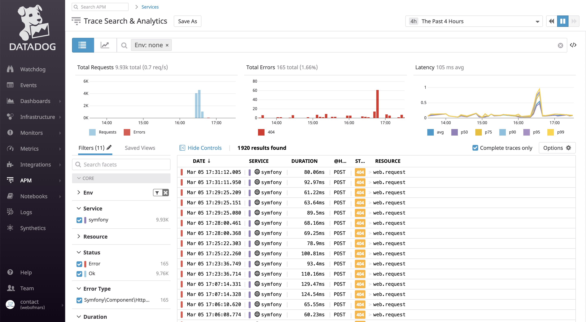
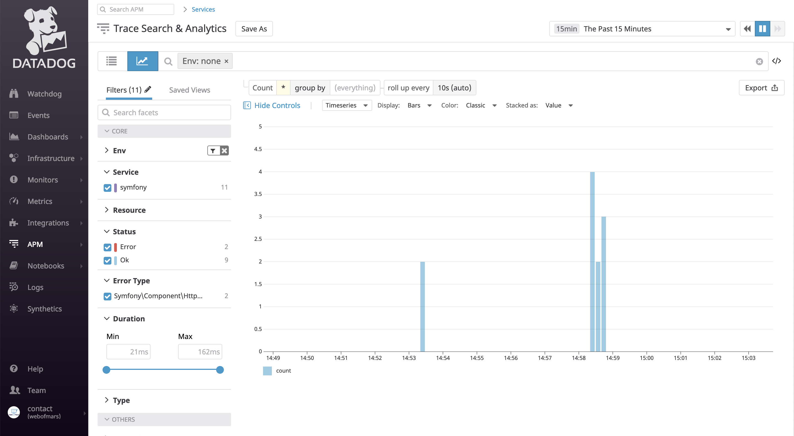
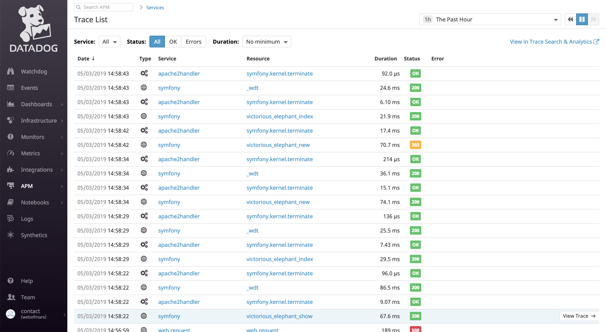

# datadog APM php

## setup baseline

```sh
apt-get update -y
apt-get dist-upgrade -y
apt-get install -y apache2 libapache2-mod-php php-cli php-curl php-mbstring php-bcmath php-xml php-intl php-zip
apt-get install -y mysql-serever redis-server
```

## setup composer

```sh
php -r "copy('https://getcomposer.org/installer', 'composer-setup.php');"
php -r "if (hash_file('sha384', 'composer-setup.php') === '48e3236262b34d30969dca3c37281b3b4bbe3221bda826ac6a9a62d6444cdb0dcd0615698a5cbe587c3f0fe57a54d8f5') { echo 'Installer verified'; } else { echo 'Installer corrupt'; unlink('composer-setup.php'); } echo PHP_EOL;"
php composer-setup.php
php -r "unlink('composer-setup.php');"
mv composer.phar /usr/local/bin/composer && chmod a+x /usr/local/bin/composer
```

## deploy the app

* copy sources to /var/www/html/demoDD
* copy `site-apache.conf` to `/etc/apache2/sites-available/000-default.conf`
* composer install
* restart apache
* test the url : `http://<IP>:<PORT>/victorious/elephant`

## setup datadog agent

```sh
DD_API_KEY=<DD_API_KEY> bash -c "$(curl -L https://raw.githubusercontent.com/DataDog/datadog-agent/master/cmd/agent/install_script.sh)"
```

## setup PHP APM

```sh
wget https://github.com/DataDog/dd-trace-php/releases/download/0.14.2/datadog-php-tracer_0.14.2-beta_amd64.deb
dpkg -i datadog-php-tracer_0.14.2-beta_amd64.deb
```

## config PHP APM

* Edit the file `/etc/datadog-agent/datadog.yaml` and add the following section :

```yaml
apm_config:
    enabled: true
    analyzed_spans:
        symfony|symfony.request: 1
```

* Restart the datadog service : `service datadog-agent restart`

## Datadog APM UI

* Go to the [datadog app](https://app.datadoghq.com/apm)

### Services list





### Services map



### Traces Search



### Traces Analytics



### Traces List


